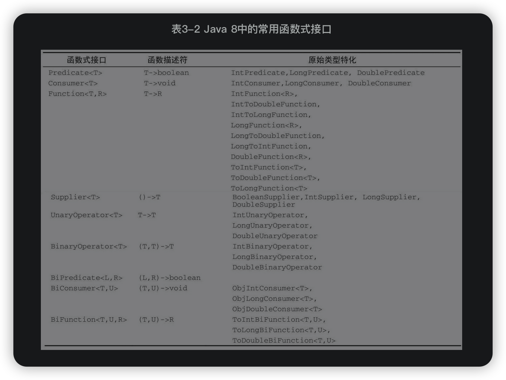

## Predicate接口示例
```
import java.util.function.Predicate;
import java.util.stream.Collectors;

@Slf4j
public class TestPredicate {
/**
* Predicate在filter()中使用
* filter()接收predicate参数
*/
@Test
public void testPredicateFilter() {
Predicate<Integer> noGreaterThan5 = x -> x > 5;
List<Integer> list = Arrays.asList(1, 2, 3, 4, 5, 6, 7, 8, 9, 10);
List<Integer> collect = list.stream().filter(noGreaterThan5).collect(Collectors.toList());
System.out.println(collect);
// [6, 7, 8, 9, 10]
}

/**
 * Predicate在and()中使用
 * 多个过滤
 */
@Test
public void testPredicateAnd() {
    Predicate<Integer> noGreaterThan5 = x -> x > 5;
    Predicate<Integer> noLessThan8 = x -> x < 8;
    List<Integer> list = Arrays.asList(1, 2, 3, 4, 5, 6, 7, 8, 9, 10);
    List<Integer> collect = list.stream()
            .filter(noGreaterThan5.and(noLessThan8))
            .collect(Collectors.toList());
    System.out.println(collect);
//        [6, 7]
}

/**
 * Predicate.or()
 * 满足任意条件即可
 */
@Test
public void testPredicateOr() {
    Predicate<String> lengthIs3 = x -> x.length() == 3;
    Predicate<String> startWithA = x -> x.startsWith("A");
    List<String> list = Arrays.asList("A", "AA", "AAA", "B", "BB", "BBB");
    List<String> collect = list.stream()
            .filter(lengthIs3.or(startWithA))
            .collect(Collectors.toList());
    System.out.println(collect);
//        [A, AA, AAA, BBB]
}

/**
 * Predicate.negate()
 * 查找所有不以‘A’开头的元素
 */
@Test
public void testPredicateNegate() {
    Predicate<String> startWithA = x -> x.startsWith("A");
    List<String> list = Arrays.asList("A", "AA", "AAA", "B", "BB", "BBB");
    List<String> collect = list.stream()
            .filter(startWithA.negate())
            .collect(Collectors.toList());
    System.out.println(collect);
//        [B, BB, BBB]
}

/**
 * Predicate.test()
 */
@Test
public void testPredicateTest() {
    List<String> list = Arrays.asList("A", "AA", "AAA", "B", "BB", "BBB");

    System.out.println(StringProcessor.filter(
            list, x -> x.startsWith("A")));
    // [A, AA, AAA]

    System.out.println(StringProcessor.filter(
            list, x -> x.startsWith("A") && x.length() == 3));
    // [AAA]
}

static class StringProcessor {
    static List<String> filter(List<String> list, Predicate<String> predicate) {
        return list.stream().filter(predicate::test).collect(Collectors.toList());
    }
}

/**
 * 链式Predicate
 */
@Test
public void testPredicateLian() {
    Predicate<String> startWithA = x -> x.startsWith("a");

    // start with "a" or "m"
    boolean result = startWithA.or(x -> x.startsWith("m")).test("mkyong");
    System.out.println(result);
    // true

    // !(start with "a" and length is 3)
    boolean result2 = startWithA.and(x -> x.length() == 3).negate().test("abc");
    System.out.println(result2);
    // false
}

/**
 * removeIf() 方法用于删除所有满足特定条件的数组元素。
 */
@Test
public void testListRemoveIf() {
    List<String> list = Arrays.asList("A", "AA", "AAA", "B", "BB", "BBB");
    Predicate<String> predicate = x -> x.startsWith("A");
    List<String> list2 = Lists.newArrayList();
    list2.addAll(list);
    list2.removeIf(predicate);
    log.info(list2.toString());
}
}

```


## 函数接口定义
哪怕有很多默认方法，只要接口只定义了一个抽象方法，它就仍然是一个函数式接口


  
